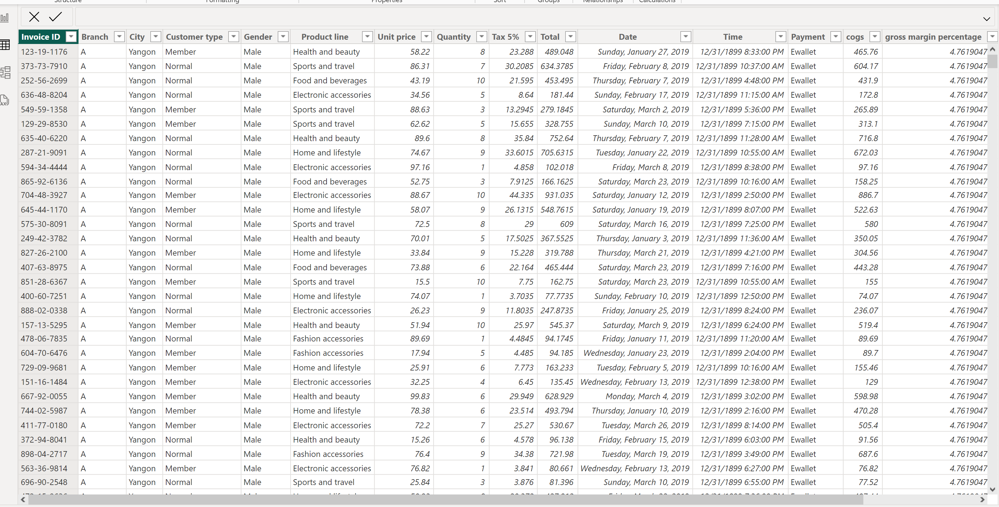

# Supermaket Tax Analysis 

--- 
## INTRODUCTION 

This is a POWERBI project on Tax/sales analysis of a Supermarket.
The project is to analyze and derive insights to answer crucial business questions and help the supermarket make data-driven decisions.
**_Disclaimer_**: _All datasets and reports do not represent any company, supermarket, institution, or country, but just a dummy dataset to demonstrate the capabilities of PowerBI._

---
## Problem Statement: 

Problem Statement
1. Total amount generated on Tax,
2. Gender with most paid tax,
3. Product categories that result in the highest taxes,
4. Payment method that allows easy deduction of tax?
5. General Sales analysis.

## Skills/Concepts demonstrated:

The following PowerBI tools were utilized:

- Data conversion,
- Data importation,
- Data cleaning using PowerQuery, 
- Data modeling/Sorting/arrangement,
- Dashboard Design,
- Slicers and Page navigation buttons.

## Data Cleaning/Data modeling:

---

## Visualization:
This Dashboard shows the main points but is not limited to the problems stated above, also denoting the sales report.

Dashboard                 |         Dashboard 
:-----------------------: | :--------------------:
              |          

---

## Features
- The slicers on months show the interactiveness of the dashboard making changes.
- Page navigation buttons in the pages for easy navigation through the pages.
---
## Analysis:

### Tax :
The supermarket generated $15.38k on tax with 6 product lines in the store (shown in the dashboard).
Also to note that food and beverages result in more taxes than other products.

### Customers History:
There are about 1000 customers who patronize the supermarket.
This is also on the side that Female customers pay more tax than male customers.

## Conclusion and Recommendations:
Coffee and Chocolate are the most in demand at each store.
Hell's Kitchen has the highest sales and generates more revenue but just a slight difference from other stores.

#Recommendation: 
The coffee and chocolate categories should be restocked as soon as possible based on weekly sales so the store won't run out of the products,
All  should be paid more attention to for redistribution
